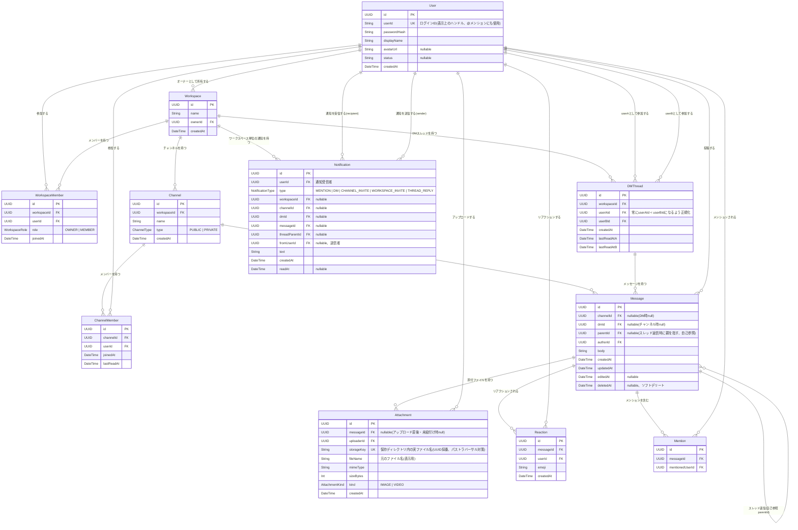

# ChatSpace DB設計書

**バージョン:** 1.0
**作成日:** 2026-08-15
**作成者:** Nakata Saki

---

## 1. 概要

### 1.1 設計方針

- **主キーは UUID**(アプリ側生成)とする。SQLite プロトタイプの `cuid()` から置き換える。v4 は PostgreSQL の B-tree インデックスを断片化させやすいため、**UUIDv7(時系列局所性のあるUUID)の採番ライブラリ採用を検討事項として記録する**(必須ではないが一考の価値がある改善)
- **ソフトデリート**は `Message.deleted_at` の nullable カラムで表現する。Hibernate の `@SQLDelete` フィルタは使わず、明示クエリで扱う。**ただし除外(`deleted_at IS NULL`)が必要なのは検索クエリのみであり、一覧・スレッド・コンテキスト取得は削除済み行を除外せずtombstone(本文を伏せた行)として返す**(レビュー指摘により訂正。画面設計書の「このメッセージは削除されました」表示が再読み込み後も維持されること、および親メッセージ削除時にスレッド返信への到達性を保つことを優先した設計。詳細はメッセージング機能定義書§3.3・§6.3、検索機能定義書§6を参照)
- 列挙値(`WorkspaceRole`/`ChannelType`/`AttachmentKind`/`NotificationType`)は SQLite プロトタイプでは String カラムだったが、PostgreSQL 移行にあわせて **Java enum + `@Enumerated(EnumType.STRING)`** に変更する(DB上は VARCHAR に列挙値の文字列を保存し、CHECK 制約で許容値を制限する)
- `Message.parent_id`/`replies` は自己参照 `@ManyToOne`/`@OneToMany` によりスレッドを表現する
- **マイグレーションは Flyway** で管理し、`ddl-auto: update` は使用しない(スキーマ変更は必ずバージョン管理されたマイグレーションファイルを通す)
- **ページネーションは `(created_at, id)` の複合カーソル**を全面的に採用する(メッセージ一覧・スレッド返信一覧・検索結果・通知一覧)。`created_at` 単独では同一ミリ秒に複数行が存在した場合に取りこぼす可能性があるため、`WHERE (created_at, id) < (:cursorCreatedAt, :cursorId) ORDER BY created_at DESC, id DESC` の形でクエリを統一する
- **メッセージ検索**は PostgreSQL `pg_trgm` 拡張 + `ILIKE` による部分一致検索を行う。`Message.body` に GIN インデックス(`gin_trgm_ops`)を追加する。3文字未満のクエリはインデックスが効かず seq scan にフォールバックし得る既知の制約がある(詳細は検索機能定義書を参照)
- 移植元は `apps/api/prisma/schema.prisma`(SQLite プロトタイプ)であり、本書は同スキーマを PostgreSQL + JPA エンティティ設計として起こしたものである

### 1.2 3層アーキテクチャとの関係

各テーブルに対応する JPA エンティティ(`*.java`)・`*Repository.java`(Spring Data JPA)は、ドメイン機能パッケージ(`user/`, `workspace/`, `channel/`, `dm/`, `message/`, `notification/` 等)内の**データアクセス層**に配置する。Controller から Repository を直接呼び出すことは禁止し(層飛ばし禁止)、Service 層(ビジネスロジック層・認可チェック)を必ず経由する。この制約は ArchUnit による自動テストで強制する。詳細は `docs/インフラ構成書.md` を参照。

### 1.3 Flyway マイグレーションファイル構成

`apps/api/src/main/resources/db/migration/` 配下に `V{番号}__{説明}.sql` 形式で配置する。

```
V1__create_extension_pg_trgm.sql       -- pg_trgm 拡張の有効化
V2__create_users.sql
V3__create_workspaces.sql
V4__create_workspace_members.sql
V5__create_channels.sql
V6__create_channel_members.sql
V7__create_dm_threads.sql
V8__create_messages.sql                 -- message_body_trgm_idx(GINインデックス)含む
V9__create_attachments.sql
V10__create_reactions.sql
V11__create_mentions.sql
V12__create_notifications.sql
```

- 適用済みマイグレーションファイルは改変しない(変更が必要な場合は新しい番号のファイルを追加する)
- CI では `./gradlew flywayValidate` により、適用済みファイルの改変が無いことを検証する(詳細は `docs/インフラ構成書.md` の CI構成を参照)

---

## 2. ER図



---

## 3. テーブル定義書

### 3.1 users テーブル

| カラム名 | 型 | NULL | デフォルト | 説明 |
|---------|-----|------|-----------|------|
| id | UUID | NOT NULL | アプリ側生成 | ユーザーID |
| user_id | VARCHAR(32) | NOT NULL | - | ログインID(表示上のハンドル、`@メンション`にも使用) |
| password_hash | VARCHAR(255) | NOT NULL | - | bcrypt(コストファクタ12)でハッシュ化済みパスワード |
| display_name | VARCHAR(64) | NOT NULL | - | 表示名 |
| avatar_url | TEXT | NULL | - | アバター画像URL |
| status | VARCHAR(128) | NULL | - | ステータス文言 |
| created_at | TIMESTAMPTZ | NOT NULL | now() | 作成日時 |

**制約**
- 主キー: `id`
- 一意制約: `user_id`

**インデックス**
| インデックス名 | カラム | 目的 |
|-------------|-------|------|
| users_user_id_key | user_id | ログインID・メンション解決による検索 |

---

### 3.2 workspaces テーブル

| カラム名 | 型 | NULL | デフォルト | 説明 |
|---------|-----|------|-----------|------|
| id | UUID | NOT NULL | アプリ側生成 | ワークスペースID |
| name | VARCHAR(64) | NOT NULL | - | ワークスペース名 |
| owner_id | UUID | NOT NULL | - | オーナーのユーザーID |
| created_at | TIMESTAMPTZ | NOT NULL | now() | 作成日時 |

**制約**
- 主キー: `id`
- 外部キー: `owner_id` → `users.id`

**インデックス**
| インデックス名 | カラム | 目的 |
|-------------|-------|------|
| workspaces_owner_id_idx | owner_id | オーナー別ワークスペース取得 |

---

### 3.3 workspace_members テーブル

| カラム名 | 型 | NULL | デフォルト | 説明 |
|---------|-----|------|-----------|------|
| id | UUID | NOT NULL | アプリ側生成 | ワークスペースメンバーID |
| workspace_id | UUID | NOT NULL | - | ワークスペースID |
| user_id | UUID | NOT NULL | - | ユーザーID |
| role | VARCHAR(16) | NOT NULL | 'MEMBER' | `OWNER` \| `MEMBER`(Java enum, `@Enumerated(EnumType.STRING)`) |
| joined_at | TIMESTAMPTZ | NOT NULL | now() | 参加日時 |

**制約**
- 主キー: `id`
- 一意制約: `(workspace_id, user_id)`
- 外部キー: `workspace_id` → `workspaces.id`(CASCADE DELETE)、`user_id` → `users.id`(CASCADE DELETE)
- CHECK制約: `role IN ('OWNER', 'MEMBER')`

**インデックス**
| インデックス名 | カラム | 目的 |
|-------------|-------|------|
| workspace_members_workspace_user_key | (workspace_id, user_id) | 一意制約兼メンバーシップ判定(`requireMember`/`requireOwner`) |
| workspace_members_user_id_idx | user_id | ユーザー別所属ワークスペース一覧取得 |

---

### 3.4 channels テーブル

| カラム名 | 型 | NULL | デフォルト | 説明 |
|---------|-----|------|-----------|------|
| id | UUID | NOT NULL | アプリ側生成 | チャンネルID |
| workspace_id | UUID | NOT NULL | - | ワークスペースID |
| name | VARCHAR(80) | NOT NULL | - | チャンネル名 |
| type | VARCHAR(16) | NOT NULL | - | `PUBLIC` \| `PRIVATE`(Java enum) |
| created_at | TIMESTAMPTZ | NOT NULL | now() | 作成日時 |

**制約**
- 主キー: `id`
- 一意制約: `(workspace_id, name)`
- 外部キー: `workspace_id` → `workspaces.id`(CASCADE DELETE)
- CHECK制約: `type IN ('PUBLIC', 'PRIVATE')`

**インデックス**
| インデックス名 | カラム | 目的 |
|-------------|-------|------|
| channels_workspace_name_key | (workspace_id, name) | 一意制約兼チャンネル名検索 |
| channels_workspace_type_idx | (workspace_id, type) | パブリックチャンネル一覧の絞り込み表示 |

---

### 3.5 channel_members テーブル

| カラム名 | 型 | NULL | デフォルト | 説明 |
|---------|-----|------|-----------|------|
| id | UUID | NOT NULL | アプリ側生成 | チャンネルメンバーID |
| channel_id | UUID | NOT NULL | - | チャンネルID |
| user_id | UUID | NOT NULL | - | ユーザーID |
| joined_at | TIMESTAMPTZ | NOT NULL | now() | 参加日時 |
| last_read_at | TIMESTAMPTZ | NOT NULL | now() | 最終既読日時(未読メッセージ判定に使用) |

**制約**
- 主キー: `id`
- 一意制約: `(channel_id, user_id)`
- 外部キー: `channel_id` → `channels.id`(CASCADE DELETE)、`user_id` → `users.id`(CASCADE DELETE)

**インデックス**
| インデックス名 | カラム | 目的 |
|-------------|-------|------|
| channel_members_channel_user_key | (channel_id, user_id) | 一意制約兼メンバーシップ判定(`requireChannelMember`) |
| channel_members_user_id_idx | user_id | ユーザー別所属チャンネル一覧取得(検索スコープ解決にも使用) |

---

### 3.6 dm_threads テーブル

| カラム名 | 型 | NULL | デフォルト | 説明 |
|---------|-----|------|-----------|------|
| id | UUID | NOT NULL | アプリ側生成 | DMスレッドID |
| workspace_id | UUID | NOT NULL | - | ワークスペースID |
| user_a_id | UUID | NOT NULL | - | 参加者A(常に `user_a_id < user_b_id` になるよう正規化) |
| user_b_id | UUID | NOT NULL | - | 参加者B |
| created_at | TIMESTAMPTZ | NOT NULL | now() | 作成日時 |
| last_read_at_a | TIMESTAMPTZ | NOT NULL | now() | 参加者Aの最終既読日時 |
| last_read_at_b | TIMESTAMPTZ | NOT NULL | now() | 参加者Bの最終既読日時 |

**制約**
- 主キー: `id`
- 一意制約: `(workspace_id, user_a_id, user_b_id)`
- 外部キー: `workspace_id` → `workspaces.id`(CASCADE DELETE)、`user_a_id`/`user_b_id` → `users.id`(CASCADE DELETE)

**インデックス**
| インデックス名 | カラム | 目的 |
|-------------|-------|------|
| dm_threads_workspace_users_key | (workspace_id, user_a_id, user_b_id) | 一意制約兼ハンドル解決 |
| dm_threads_user_a_idx | user_a_id | 参加者別DM一覧取得 |
| dm_threads_user_b_idx | user_b_id | 参加者別DM一覧取得 |

**設計上の注意点**: `DmAuthorizationService.requireDmAccess()` は本テーブルの参加者チェックに加え、`workspace_members` に対する現在有効なメンバーシップも必須条件として検証する(ワークスペースキック後もDM参加者情報自体は消えないため、参加者チェックのみでは不十分)。

---

### 3.7 messages テーブル

| カラム名 | 型 | NULL | デフォルト | 説明 |
|---------|-----|------|-----------|------|
| id | UUID | NOT NULL | アプリ側生成 | メッセージID |
| channel_id | UUID | NULL | - | チャンネルID(DMの場合null) |
| dm_id | UUID | NULL | - | DMスレッドID(チャンネルの場合null) |
| parent_id | UUID | NULL | - | 親メッセージID(スレッド返信の場合。自己参照) |
| author_id | UUID | NOT NULL | - | 投稿者のユーザーID |
| body | TEXT | NOT NULL | - | メッセージ本文(Markdown記述、`pg_trgm` 検索対象) |
| created_at | TIMESTAMPTZ | NOT NULL | now() | 作成日時 |
| updated_at | TIMESTAMPTZ | NOT NULL | now() | 更新日時 |
| edited_at | TIMESTAMPTZ | NULL | - | 編集日時(編集された場合のみ) |
| deleted_at | TIMESTAMPTZ | NULL | - | 削除日時(ソフトデリート。検索クエリのみ`deleted_at IS NULL`で除外し、一覧・スレッド・コンテキスト取得はtombstoneとして含める。§1.1参照) |

**制約**
- 主キー: `id`
- 外部キー: `channel_id` → `channels.id`(CASCADE DELETE)、`dm_id` → `dm_threads.id`(CASCADE DELETE)、`parent_id` → `messages.id`(CASCADE DELETE)、`author_id` → `users.id`
- CHECK制約: `(channel_id IS NOT NULL) <> (dm_id IS NOT NULL)`(排他的論理和。**レビュー指摘により`OR`から修正**: 単純な`OR`だと両方NOT NULLの行も許容されてしまい「チャンネルかDMのどちらか一方」という設計意図と矛盾するため、XOR相当の制約に変更した)

**インデックス**
| インデックス名 | カラム | 目的 |
|-------------|-------|------|
| messages_channel_created_id_idx | (channel_id, created_at DESC, id DESC) | チャンネル別メッセージ一覧の `(created_at, id)` 複合カーソルページング |
| messages_dm_created_id_idx | (dm_id, created_at DESC, id DESC) | DM別メッセージ一覧の複合カーソルページング |
| messages_parent_id_idx | parent_id | スレッド返信一覧取得 |
| **message_body_trgm_idx** | body(GIN, `gin_trgm_ops`) | `pg_trgm` + `ILIKE` による部分一致検索(3文字未満のクエリは seq scan にフォールバックし得る既知の制約あり) |

`message_body_trgm_idx` は以下の Flyway マイグレーションで作成する。

```sql
CREATE EXTENSION IF NOT EXISTS pg_trgm;
CREATE INDEX message_body_trgm_idx ON messages USING GIN (body gin_trgm_ops);
```

---

### 3.8 attachments テーブル

| カラム名 | 型 | NULL | デフォルト | 説明 |
|---------|-----|------|-----------|------|
| id | UUID | NOT NULL | アプリ側生成 | 添付ファイルID |
| message_id | UUID | NULL | - | 紐付くメッセージID(アップロード直後・未紐付け時はnull) |
| uploader_id | UUID | NOT NULL | - | アップロードしたユーザーID |
| storage_key | VARCHAR(255) | NOT NULL | - | 保存ディレクトリ内の実ファイル名(UUID採番、クライアント指定は信用しない) |
| file_name | VARCHAR(255) | NOT NULL | - | 元のファイル名(表示用) |
| mime_type | VARCHAR(64) | NOT NULL | - | マジックバイト判定により検出したMIMEタイプ |
| size_bytes | INTEGER | NOT NULL | - | ファイルサイズ(バイト、上限25MB) |
| kind | VARCHAR(16) | NOT NULL | - | `IMAGE` \| `VIDEO`(Java enum) |
| created_at | TIMESTAMPTZ | NOT NULL | now() | 作成日時 |

**制約**
- 主キー: `id`
- 一意制約: `storage_key`
- 外部キー: `message_id` → `messages.id`(CASCADE DELETE)、`uploader_id` → `users.id`
- CHECK制約: `kind IN ('IMAGE', 'VIDEO')`

**インデックス**
| インデックス名 | カラム | 目的 |
|-------------|-------|------|
| attachments_storage_key_key | storage_key | 配信エンドポイントでの実ファイル解決 |
| attachments_message_id_idx | message_id | メッセージ別添付ファイル取得 |

**設計上の注意点**: 配信エンドポイントは取得の都度、`message_id` から辿れるチャンネル/DM に対する**ライブな権限チェック**を再実行する(アップロード時点のみのチェックにしない)。`message_id IS NULL` の未紐付けレコード(定期クリーンアップは優先度低として未実装)、DB保存失敗時の孤児ファイル削除も同様に優先度低の既知のギャップとする。

---

### 3.9 reactions テーブル

| カラム名 | 型 | NULL | デフォルト | 説明 |
|---------|-----|------|-----------|------|
| id | UUID | NOT NULL | アプリ側生成 | リアクションID |
| message_id | UUID | NOT NULL | - | メッセージID |
| user_id | UUID | NOT NULL | - | リアクションしたユーザーID |
| emoji | VARCHAR(32) | NOT NULL | - | 絵文字 |
| created_at | TIMESTAMPTZ | NOT NULL | now() | 作成日時 |

**制約**
- 主キー: `id`
- 一意制約: `(message_id, user_id, emoji)`(同一ユーザーが同一メッセージに同一絵文字で重複リアクションすることを防止)
- 外部キー: `message_id` → `messages.id`(CASCADE DELETE)、`user_id` → `users.id`(CASCADE DELETE)

**インデックス**
| インデックス名 | カラム | 目的 |
|-------------|-------|------|
| reactions_message_user_emoji_key | (message_id, user_id, emoji) | 一意制約兼トグル判定 |
| reactions_message_id_idx | message_id | メッセージ別リアクション集計取得 |

---

### 3.10 mentions テーブル

| カラム名 | 型 | NULL | デフォルト | 説明 |
|---------|-----|------|-----------|------|
| id | UUID | NOT NULL | アプリ側生成 | メンションID |
| message_id | UUID | NOT NULL | - | メッセージID |
| mentioned_user_id | UUID | NOT NULL | - | メンションされたユーザーID |

**制約**
- 主キー: `id`
- 外部キー: `message_id` → `messages.id`(CASCADE DELETE)、`mentioned_user_id` → `users.id`

**インデックス**
| インデックス名 | カラム | 目的 |
|-------------|-------|------|
| mentions_mentioned_user_id_idx | mentioned_user_id | ユーザー宛メンション一覧取得 |
| mentions_message_id_idx | message_id | メッセージ別メンション一覧取得 |

**設計上の注意点**: `MentionResolver` はメッセージ本文の正規表現抽出後、**その時点のライブなチャンネルメンバーシップ**とのみ突合してレコードを作成する(非メンバーへの通知・存在漏洩を防止)。メンション自動補完(候補一覧取得API)も同じ制約を負い、対象チャンネルのメンバーに絞り込んだ候補のみを返す。

---

### 3.11 notifications テーブル

| カラム名 | 型 | NULL | デフォルト | 説明 |
|---------|-----|------|-----------|------|
| id | UUID | NOT NULL | アプリ側生成 | 通知ID |
| user_id | UUID | NOT NULL | - | 通知受信者のユーザーID |
| type | VARCHAR(20) | NOT NULL | - | `MENTION` \| `DM` \| `CHANNEL_INVITE` \| `WORKSPACE_INVITE` \| `THREAD_REPLY`(Java enum) |
| workspace_id | UUID | NULL | - | 対象ワークスペースID(`WORKSPACE_INVITE`はこのみ設定) |
| channel_id | UUID | NULL | - | 対象チャンネルID |
| dm_id | UUID | NULL | - | 対象DMスレッドID |
| message_id | UUID | NULL | - | 対象メッセージID |
| thread_parent_id | UUID | NULL | - | スレッド返信通知の場合の親メッセージID |
| from_user_id | UUID | NULL | - | 通知の送信元ユーザーID |
| text | TEXT | NOT NULL | - | 通知本文(メッセージ本文のプレビュー等を含む) |
| created_at | TIMESTAMPTZ | NOT NULL | now() | 通知日時 |
| read_at | TIMESTAMPTZ | NULL | - | 既読日時 |

**制約**
- 主キー: `id`
- 外部キー: `user_id` → `users.id`(CASCADE DELETE)、`workspace_id` → `workspaces.id`(CASCADE DELETE)、`channel_id` → `channels.id`(CASCADE DELETE)、`dm_id` → `dm_threads.id`(CASCADE DELETE)、`from_user_id` → `users.id`(SET NULL)
- CHECK制約: `type IN ('MENTION', 'DM', 'CHANNEL_INVITE', 'WORKSPACE_INVITE', 'THREAD_REPLY')`(レビュー指摘により追加: `THREAD_REPLY`はスレッド返信通知として通知機能定義書で定義されているが、当初のER図・CHECK制約から漏れていたため追加)

**インデックス**
| インデックス名 | カラム | 目的 |
|-------------|-------|------|
| notifications_user_read_idx | (user_id, read_at) | 未読通知件数・一覧の取得 |
| notifications_user_created_id_idx | (user_id, created_at DESC, id DESC) | 通知一覧の `(created_at, id)` 複合カーソルページング |

**設計上の注意点(通知のスコープ漏洩防止、最重要)**: 通知一覧取得・未読件数(`unread-count`)・個別既読(`POST /notifications/{id}/read`)・全件既読(`POST /notifications/read-all`)の全エンドポイントで、各通知が指す `channel_id`/`dm_id`/`workspace_id` に対する**現在のライブなメンバーシップ**を再検証し、非メンバーになったものを除外する。N+1クエリを避けるため、`Notification` を `channel_members`/`dm_threads`+`workspace_members`/`workspace_members` と `EXISTS` で結合する1本の Repository クエリで一括絞り込みする。3条件は**必ず `AND` で結合**すること(`OR` 結合すると `channel_id IS NULL` によりDM側の節が常に真になりフィルタが無効化される致命的なバグになる)。

```sql
WHERE (channel_id IS NULL OR EXISTS (
         SELECT 1 FROM channel_members cm
         WHERE cm.channel_id = notifications.channel_id AND cm.user_id = :userId))
  AND (dm_id IS NULL OR EXISTS (
         SELECT 1 FROM dm_threads dt
         JOIN workspace_members wm ON wm.workspace_id = dt.workspace_id AND wm.user_id = :userId
         WHERE dt.id = notifications.dm_id AND (dt.user_a_id = :userId OR dt.user_b_id = :userId)))
  AND (workspace_id IS NULL OR EXISTS (
         SELECT 1 FROM workspace_members wm
         WHERE wm.workspace_id = notifications.workspace_id AND wm.user_id = :userId))
```

DM側の `EXISTS` は「DM参加者か」だけでは不十分で、`workspace_members` との `JOIN` を必ず含める(`dm_threads.user_a_id`/`user_b_id` はワークスペースキック後も消えないため)。

---

## 4. 関連ドキュメント

水平スケール対応(RabbitMQ外部ブローカーリレー・Redis共有プレゼンス・キック通知配送のoutbox化)は検討の結果
実施しないことが確定したため、旧「フェーズ13で追加するテーブル」節(`session_eviction_outbox`)は削除した。

| ドキュメント名 | ファイル |
|--------------|---------|
| 要件定義書 | [要件定義書.md](要件定義書.md) |
| API 仕様書(Swagger UI) | 開発サーバー起動中の `/swagger-ui.html`(手書きファイルは廃止しSwagger自動生成に一本化) |
| インフラ構成書 | [インフラ構成書.md](インフラ構成書.md) |
| 検索機能定義書 | [機能定義書/検索機能定義書.md](機能定義書/検索機能定義書.md) |
| 通知機能定義書 | [機能定義書/通知機能定義書.md](機能定義書/通知機能定義書.md) |
| 再設計計画書 | [../.plans/java-spring-boot-redesign.md](../.plans/java-spring-boot-redesign.md)(Git管理対象外の作業メモ。詳細は`要件定義書.md`冒頭の「一次情報源についての注記」参照) |