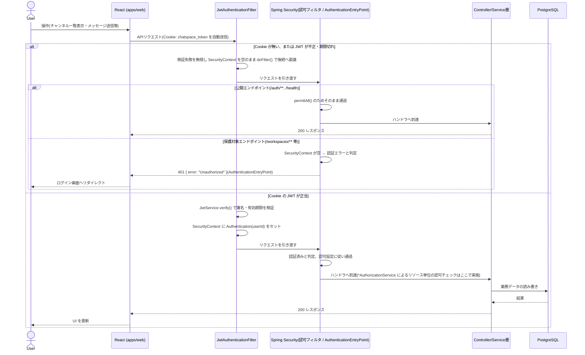
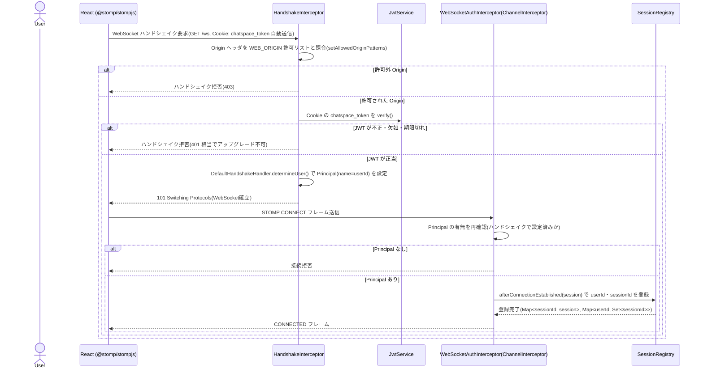
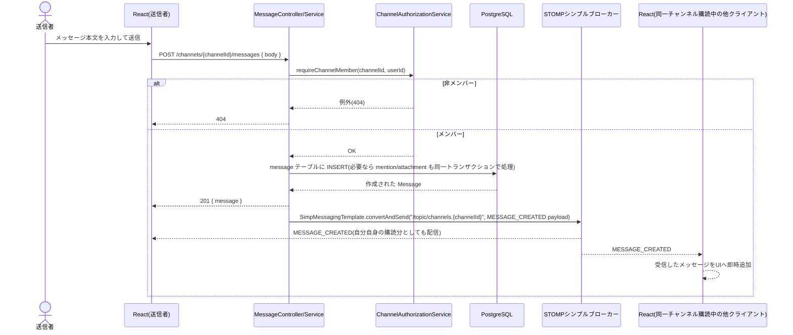
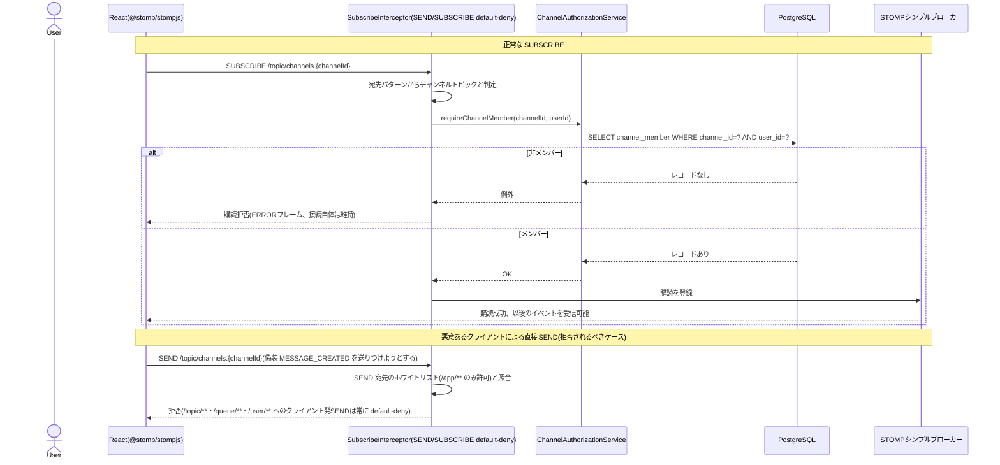
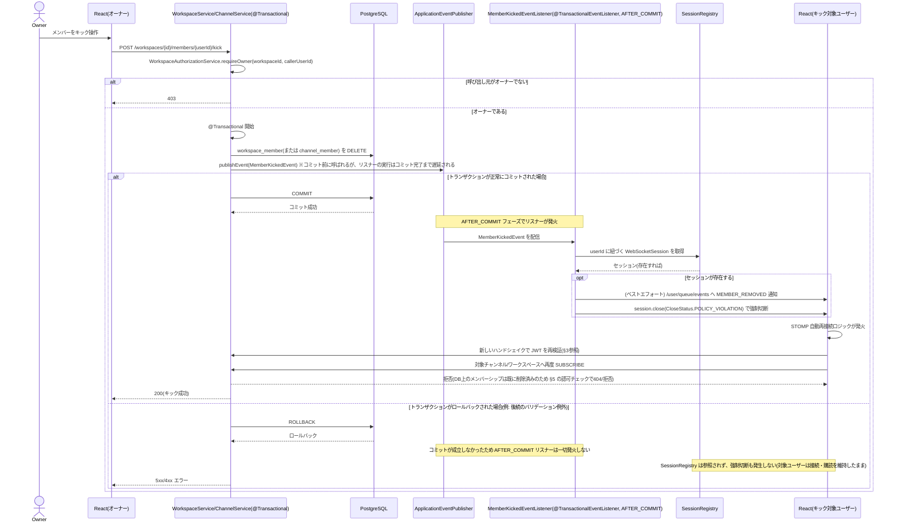
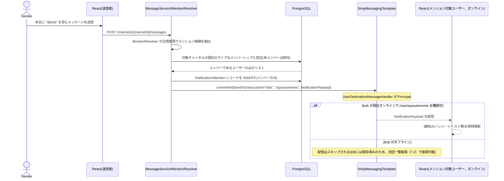
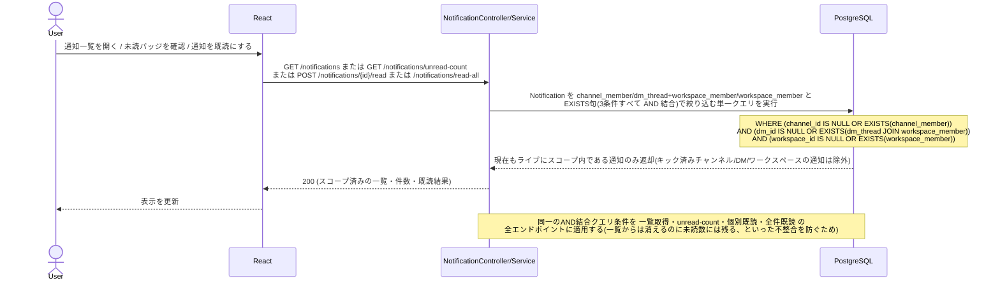
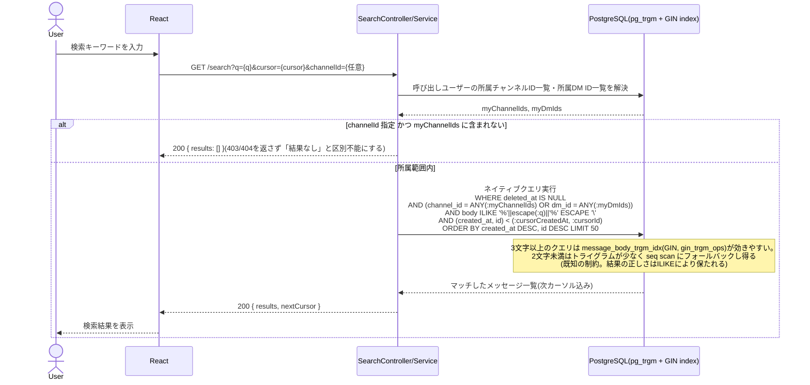

# ChatSpace シーケンス図

**バージョン:** 1.0
**作成日:** 2026-08-15
**作成者:** Nakata Saki

> 本ドキュメントは `.plans/java-spring-boot-redesign.md`(承認済み再設計計画書)を一次情報源とする。実装が計画から変更された場合は本ドキュメントも追随して更新すること。

---

## 概要

本ドキュメントでは、Java/Spring Boot + STOMP + PostgreSQL への再設計後の ChatSpace における主要な操作フローを Mermaid シーケンス図で示す。特に認可(誰が何を見られるか・実行できるか)に関わるフローは、CLAUDE.md が最大のリスクと位置づけている領域であるため、正常系だけでなく拒否・失敗系の分岐も明示する。

### 前提知識:認証・リアルタイム通信

| 項目 | 仕様 |
|------|------|
| 認証方式 | ステートレス JWT(HS256、Nimbus JOSE+JWT で発行・検証) + httpOnly Cookie |
| Cookie 名 | `chatspace_token`(`HttpOnly; SameSite=Lax; Secure`〔本番のみ〕、`path=/`) |
| JWT 有効期限 | 7日間(リフレッシュトークンなし。ログアウトはCookie削除のみでサーバー側失効なし) |
| パスワードハッシュ | bcrypt(コストファクタ12)。ユーザー不在時もダミーハッシュ比較でタイミング攻撃を防止 |
| REST 認証エントリポイント | `JwtAuthenticationFilter`(`OncePerRequestFilter`)。Cookie 欠如・不正時は 401 を返さず `SecurityContext` を空のまま後続へ委譲する |
| WebSocket エンドポイント | `/ws`(SockJS フォールバックなし、生 WebSocket のみ) |
| STOMP ブローカー | Spring 標準シンプルブローカー(インメモリ、単一インスタンス前提。フェーズ0-12) |
| WebSocket 認証タイミング | ハンドシェイク時に Cookie の JWT を検証(STOMP CONNECT フレームではない) |
| Origin 検証 | `StompEndpointRegistry.setAllowedOriginPatterns(...)` で `WEB_ORIGIN` 由来の許可オリジンのみ許可 |
| 個人宛通知の宛先 | `/user/queue/events`(実体は `/user/{userId}/queue/events`、`convertAndSendToUser()` で解決) |

---

## 1. ユーザー登録・ログイン

JWT発行とCookie設定の流れを示す。登録・ログインいずれも成功時は同じ形式(HS256・7日間有効)のJWTを`chatspace_token`Cookieに設定する。

```mermaid
sequenceDiagram
    actor User
    participant Web as React (apps/web)
    participant API as AuthController
    participant Pwd as PasswordService (bcrypt)
    participant Jwt as JwtService
    participant DB as PostgreSQL

    Note over User,DB: 新規登録
    User->>Web: ユーザーID・パスワードを入力して登録ボタン押下
    Web->>Web: バリデーション(ユーザーIDの形式・文字数、パスワード必須)
    alt バリデーションエラー
        Web-->>User: エラーメッセージを表示
    else バリデーション OK
        Web->>API: POST /auth/signup { userId, password }
        API->>DB: ユーザーID重複チェック(SELECT users WHERE user_id)
        alt ユーザーID重複
            DB-->>API: 既存ユーザーあり
            API-->>Web: 409 { error: "このユーザーIDは既に使用されています" }
            Web-->>User: エラーメッセージを表示
        else 重複なし
            API->>Pwd: hash(password, cost=12)
            Pwd-->>API: bcryptハッシュ
            API->>DB: users テーブルに INSERT
            DB-->>API: 作成されたユーザー(内部UUID)
            API->>Jwt: generate(sub=userId, exp=7日, alg=HS256, secret=JWT_SECRET)
            Jwt-->>API: 署名済みJWT
            API-->>Web: 201 + Set-Cookie: chatspace_token(HttpOnly; SameSite=Lax; Secure〔本番のみ〕; path=/; Max-Age=7日)
            Web-->>User: ワークスペース一覧画面へ遷移
        end
    end

    Note over User,DB: ログイン
    User->>Web: ユーザーID・パスワードを入力してログインボタン押下
    Web->>API: POST /auth/login { userId, password }
    API->>DB: ユーザーIDでユーザーを検索
    alt ユーザーが存在しない
        DB-->>API: 該当なし
        API->>Pwd: compare(password, DUMMY_HASH)（タイミング攻撃対策、固定ダミーハッシュに対して必ず比較する）
        Pwd-->>API: false(常に不一致)
        API-->>Web: 401 { error: "ユーザーIDまたはパスワードが正しくありません" }
        Web-->>User: エラーメッセージを表示
    else ユーザーが存在する
        DB-->>API: ユーザー(bcryptハッシュ含む)
        API->>Pwd: compare(password, storedHash)
        alt パスワード不一致
            Pwd-->>API: false
            API-->>Web: 401 { error: "ユーザーIDまたはパスワードが正しくありません" }
            Web-->>User: エラーメッセージを表示
        else パスワード一致
            Pwd-->>API: true
            API->>Jwt: generate(sub=userId, exp=7日)
            Jwt-->>API: 署名済みJWT
            API-->>Web: 200 + Set-Cookie: chatspace_token(同上属性)
            Web-->>User: ワークスペース一覧画面へ遷移
        end
    end
```

---

## 2. 認証済み API リクエスト

`JwtAuthenticationFilter`は「Cookieがあれば検証してコンテキストにセットするだけ」であり、401を返す判断そのものはSpring Securityの認可フィルタ(`AuthenticationEntryPoint`)が行う点に注意。公開エンドポイント(`/auth/**`・`/health`)は`SecurityContext`が空でもハンドラへ到達できる。



---

## 3. STOMP 接続確立

WebSocketハンドシェイク時にOrigin検証とJWT検証を行う。STOMP CONNECTフレームでの検証ではなく、ハンドシェイク(HTTPアップグレード)時点で完結させる設計。



---

## 4. メッセージ送信とリアルタイム配信

メッセージ作成はREST経由(STOMP SENDではない)。作成成功後、`RealtimeEventPublisher`が`/topic/channels.{channelId}`へブロードキャストし、購読中の全クライアント(送信者本人を含む)が受信する。



---

## 5. チャンネル SUBSCRIBE 時の認可チェック

`SUBSCRIBE`フレームは平時の認可実施点。非メンバーの購読は拒否する。あわせて、クライアントが`/topic/**`へ直接`SEND`しようとした場合の default-deny も示す。



---

## 6. キック時の強制切断

`WorkspaceService`/`ChannelService`はメンバーシップ削除のトランザクション内で`MemberKickedEvent`を発行するだけに留め、実際の`SessionRegistry`参照・`session.close()`は`@TransactionalEventListener(phase = AFTER_COMMIT)`側でのみ実行される。**ロールバック時はイベントリスナー自体が発火しないため、強制切断は発生しない。**



---

## 7. 個人宛通知の配信

`/user/queue/events`宛のプッシュ配信と、通知取得系エンドポイント(一覧・未読件数・既読化)でのライブスコープ再チェックを分けて示す。後者はCLAUDE.mdが名指しする「通知のスコープ漏洩防止」に対応する新規の受け入れテスト対象。

### 7-1. メンション通知のリアルタイム配信



### 7-2. 通知取得時のライブスコープ再チェック



---

## 8. 検索

`pg_trgm` + `ILIKE`による部分一致検索。所属チャンネル/DM集合をまず解決し、その範囲内でのみ検索する。`channelId`指定時に非所属であれば「結果なし」として扱い、403/404とは区別しない(プロトタイプと同じ設計)。



---

## 9. 関連ドキュメント

| ドキュメント | ファイル |
|------------|---------|
| 要件定義書 | [要件定義書.md](要件定義書.md) |
| DB設計書 | [DB設計書.md](DB設計書.md) |
| インフラ構成書 | [インフラ構成書.md](インフラ構成書.md) |
| API 仕様書(Swagger UI) | 開発サーバー起動中の springdoc-openapi 生成 UI(`/swagger-ui.html`)に一本化。手書きファイルは持たない |
| 認証機能定義書 | [機能定義書/認証機能定義書.md](機能定義書/認証機能定義書.md) |
| リアルタイム通信機能定義書 | [機能定義書/リアルタイム通信機能定義書.md](機能定義書/リアルタイム通信機能定義書.md) |
| 通知機能定義書 | [機能定義書/通知機能定義書.md](機能定義書/通知機能定義書.md) |
| 検索機能定義書 | [機能定義書/検索機能定義書.md](機能定義書/検索機能定義書.md) |
| 再設計計画書(一次情報源) | `.plans/java-spring-boot-redesign.md`(Git管理対象外) |