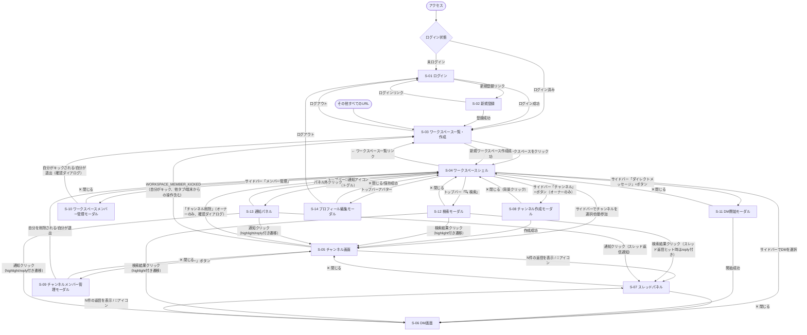

# ChatSpace 画面遷移図

**バージョン:** 1.0
**作成日:** 2026-08-15
**作成者:** Nakata Saki

> 画面ID(S-01〜S-14)は [画面設計書.md](画面設計書.md) と対応する。モーダル・パネル(S-07〜S-14)は専用URLを持たず、常に S-04/S-05/S-06 のいずれかの上に重ねて表示される点に注意(遷移というより「開く/閉じる」に近いが、TripDiary の画面遷移図と同じ形式で図示する)。

---

## 1. 画面遷移図

---

## 2. 認証ガードの方針

| URL パターン | 未ログイン時の挙動 | 備考 |
|------------|-------------------|------|
| `/login` | そのまま表示 | ログイン済みでの直接アクセスも許可(自動リダイレクトなし) |
| `/signup` | そのまま表示 | 同上 |
| `/` | `/login` にリダイレクト(`RequireAuth`) | 認証状態確認中(`status` が `idle`/`loading`)は全画面ローディング表示 |
| `/w/:workspaceId` | `/login` にリダイレクト(`RequireAuth`) | 子ルート(`c/:channelId`・`dm/:dmId`)も同じガード配下 |
| `/w/:workspaceId/c/:channelId` | `/login` にリダイレクト | 加えて、対象ワークスペース/チャンネルの非メンバーはサーバー側で404相当(存在の秘匿。プライベートチャンネルの非可視性はサーバー側認可が担保する) |
| `/w/:workspaceId/dm/:dmId` | `/login` にリダイレクト | 加えて、DM非参加者はサーバー側で404相当 |
| 上記以外すべて | `/` にリダイレクト(`<Route path="*">`) | 認証済みなら `/` → 未ログインなら連鎖的に `/login` へ |

---

## 3. 画面遷移ルール一覧

| # | 出発画面 | トリガー | 遷移先 |
|---|---------|---------|--------|
| 1 | どこからでも | 未ログインで保護ルート(`/`、`/w/**`)にアクセス | S-01 ログイン |
| 2 | S-01 ログイン | ログイン成功 | S-03 ワークスペース一覧・作成 |
| 3 | S-01 ログイン | 新規登録リンクをクリック | S-02 新規登録 |
| 4 | S-02 新規登録 | 登録成功(登録と同時に自動ログイン) | S-03 ワークスペース一覧・作成 |
| 5 | S-02 新規登録 | ログインリンクをクリック | S-01 ログイン |
| 6 | S-03 ワークスペース一覧・作成 | ワークスペースカードをクリック | S-04 ワークスペースシェル |
| 7 | S-03 ワークスペース一覧・作成 | 新規ワークスペース作成成功 | S-04 ワークスペースシェル(作成したワークスペース) |
| 8 | S-03 ワークスペース一覧・作成 | ログアウトボタン | S-01 ログイン |
| 9 | S-04 ワークスペースシェル | サイドバーで「← ワークスペース一覧」リンク | S-03 ワークスペース一覧・作成 |
| 10 | S-04 ワークスペースシェル | サイドバーでチャンネルをクリック(非参加の公開チャンネルは自動参加してから遷移) | S-05 チャンネル画面 |
| 11 | S-04 ワークスペースシェル | サイドバーでDMをクリック | S-06 DM画面 |
| 12 | S-05 チャンネル画面 / S-06 DM画面 | メッセージの「N件の返信を表示」リンク・💬アイコン | S-07 スレッドパネル(同画面上に展開) |
| 13 | S-07 スレッドパネル | ✕ 閉じるボタン | 元の S-05 / S-06 |
| 14 | S-04 ワークスペースシェル | サイドバー「チャンネル」+ボタン(オーナーのみ表示) | S-08 チャンネル作成モーダル |
| 15 | S-08 チャンネル作成モーダル | 作成成功 | S-05 チャンネル画面(作成したチャンネル) |
| 16 | S-05 チャンネル画面 | 「メンバー」ボタン | S-09 チャンネルメンバー管理モーダル |
| 17 | S-09 チャンネルメンバー管理モーダル | 自分をチャンネルから削除/自分が退出 | S-04 ワークスペースシェル(該当ワークスペースの未選択状態へ) |
| 18 | S-05 チャンネル画面 | 「チャンネル削除」(オーナーのみ、確認ダイアログ) | S-04 ワークスペースシェル(未選択状態) |
| 19 | S-04 ワークスペースシェル | サイドバー「メンバー管理」ボタン | S-10 ワークスペースメンバー管理モーダル |
| 20 | S-10 ワークスペースメンバー管理モーダル | 自分がキックされる/自分が退出(確認ダイアログ) | S-03 ワークスペース一覧・作成 |
| 21 | S-04 ワークスペースシェル | サイドバー「ダイレクトメッセージ」+ボタン | S-11 DM開始モーダル |
| 22 | S-11 DM開始モーダル | 開始成功 | S-06 DM画面(開始したDM) |
| 23 | S-04 ワークスペースシェル | トップバー「🔍 検索」ボタン | S-12 検索モーダル |
| 24 | S-12 検索モーダル | 検索結果クリック(通常メッセージ) | S-05 チャンネル画面 / S-06 DM画面(`?highlight=<id>` 付き) |
| 25 | S-12 検索モーダル | 検索結果クリック(スレッド返信がヒット) | S-05 / S-06 経由で S-07 スレッドパネルを自動展開(`?highlight=<親id>&reply=<返信id>`) |
| 26 | S-04 ワークスペースシェル | トップバー🔔通知アイコン(トグル) | S-13 通知パネル |
| 27 | S-13 通知パネル | 通知クリック(未読なら既読化) | S-05 / S-06(`?highlight=`/`?reply=` 付き、種別に応じ S-07 も自動展開) |
| 28 | S-04 ワークスペースシェル | トップバーアバターボタン | S-14 プロフィール編集モーダル |
| 29 | S-14 プロフィール編集モーダル | 保存成功 / ✕ 閉じる | S-04 ワークスペースシェル |
| 30 | S-14 プロフィール編集モーダル | ログアウトボタン | S-01 ログイン |
| 31 | S-05 チャンネル画面 / S-06 DM画面 / S-04 ワークスペースシェル全般 | 自分がワークスペースからキックされる(リアルタイムイベント受信、他端末からの操作含む) | S-03 ワークスペース一覧・作成 |
| 32 | どこからでも | 未定義のURL | S-03 ワークスペース一覧・作成(未ログイン時は連鎖的に S-01 ログイン) |

---

## 4. 関連ドキュメント

| ドキュメント | ファイル |
|------------|---------|
| 画面設計書 | [画面設計書.md](画面設計書.md) |
| 再設計計画書(§8 フロントエンド) | [../.plans/java-spring-boot-redesign.md](../.plans/java-spring-boot-redesign.md)(Git管理対象外の作業メモ。詳細は`要件定義書.md`冒頭の「一次情報源についての注記」参照) |